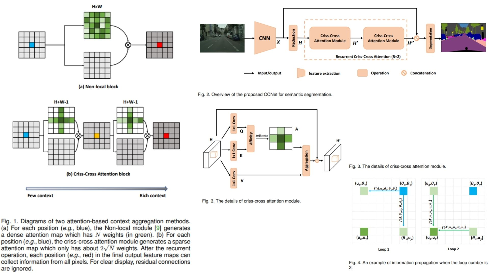

# ❌ CCNet-Replication — Criss-Cross Attention Network for Semantic Segmentation

This repository provides a **faithful Python replication** of the **CCNet (Criss-Cross Attention Network)** for **semantic segmentation**. The implementation follows the original paper design, including **Criss-Cross Attention (CCA)**, **Recurrent Criss-Cross Attention (RCCA)**, and **category-consistent feature learning**, enabling efficient global context modeling without full self-attention.

Paper reference: *Criss-Cross Network for Semantic Segmentation (CCNet)* — https://arxiv.org/abs/1811.11721

---

## Overview ✦



> The model extracts deep features using a CNN backbone and enhances them via **Criss-Cross Attention**, allowing each pixel to aggregate contextual information along its horizontal and vertical directions. Recurrent application of this mechanism enables full-image dependency modeling.

Key concepts:

- **Input feature map**:

$$
X \in \mathbb{R}^{C \times H \times W}
$$

- **Query, Key, Value projections (Fig.3)**:

$$
Q = W_q X,\quad K = W_k X,\quad V = W_v X
$$

- **Criss-Cross Attention (CCA)**:

$$
A_{i,u} = \text{softmax}(Q_u \cdot K_i)
$$

$$
H'_u = \sum_{i \in \Omega(u)} A_{i,u} V_i
$$

- **Recurrent Criss-Cross Attention (RCCA) (Fig.4)**:

$$
H \rightarrow H' \rightarrow H''
$$

After two recurrent steps, each pixel can indirectly access all other pixels in the feature map.

- **Overall pipeline (Fig.2)**:

Backbone → CCA / RCCA → Feature Fusion → Segmentation Head

---

## Why CCNet ❌➡️✔️

- Efficient global context modeling without quadratic attention cost  
- Strong performance on dense prediction tasks  
- RCCA enables implicit full-image information propagation  
- Lightweight alternative to full self-attention mechanisms  

---

## Repository Structure 🏗️
```
CCNet-Replication/
├── src/
│   │
│   ├── blocks/
│   │   ├── conv_block.py        
│   │   ├── cca.py              
│   │   ├── rcca.py             
│   │   ├── cc3d.py            
│   │   └── fusion.py       
│   │
│   ├── backbone/
│   │   └── resnet_dilated.py   
│   │
│   ├── model/
│   │   └── ccnet.py           
│   │
│   ├── head/
│   │   └── segmentation_head.py 
│   │
│   └── config.py              
│
├── images/
│   └── figmix.jpg
│
├── requirements.txt
└── README.md
```

---

## 🔗 Feedback

For questions or feedback, contact:  
[barkin.adiguzel@gmail.com](mailto:barkin.adiguzel@gmail.com)
